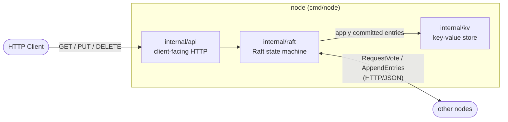
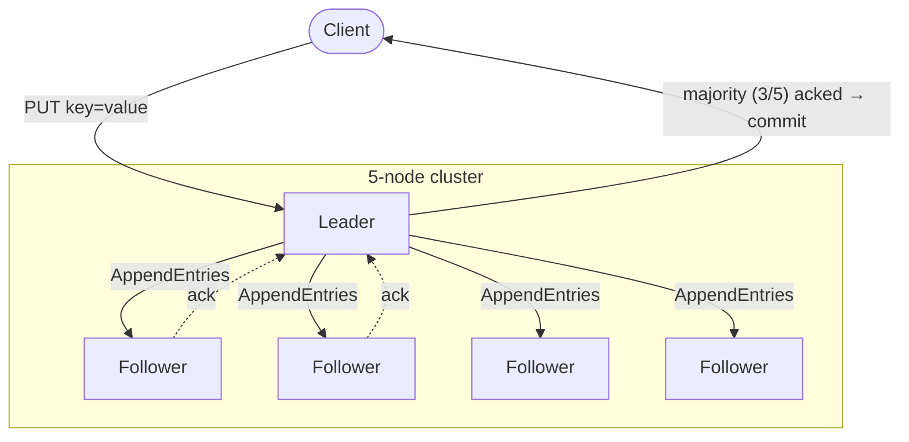

# raftkv

A distributed key-value store built on top of a **Raft consensus** implementation written from scratch.

The "store" side is deliberately kept trivial (just a `map`) — the real point is seeing how leader election, log replication, and crash recovery actually work in code, not just in theory. Nodes talk to each other over plain HTTP/JSON, so Raft messages (`RequestVote`, `AppendEntries`) can even be triggered manually with `curl`.

## Architecture

Internal layers of a single node:



Flow of a write request across a 5-node cluster:



## Directory layout

```
cmd/node        — node process entrypoint
internal/raft   — Raft state machine (election, log replication, persistence)
internal/kv     — key-value store (the data structure the state machine sits on top of)
internal/api    — client-facing HTTP API
```